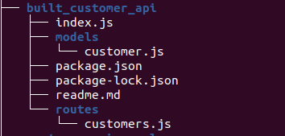

### **Nodejs API with all method i.e., GET,POST,PUT  for user object.**
---

## Directory Structure
---



## Package driver installation
 * `npm install moongoose`

## How to Run
---
* Start a MongoDB Server
    On linux Terminal `sudo systemctl start mysql.service`
    Note :If you have allready install service od moongodb otherwise you need to install

*	Run Server `node index.js` || `nodemon index.json`

## API call syntax using curl
---

* GET method  ```curl -X GET http://localhost:port number/api/customers```

* DELETE method ```curl -X POST http://localhost:port number/api/customers/id```

* POST method ```curl -X POST -d '{
  "userName": "gauri12",
  "email":"gaur@gmail.com",
  "password":"12345678",
  "mobileNumber":"6789012345",
  "birthYear": 1995,
  "skillSet":["python","elasticsearch"],
  "is_active": true


}' http://localhost:port number/api/userinfo
 ```

## Author
---
* Name : Gaurihar Darade
